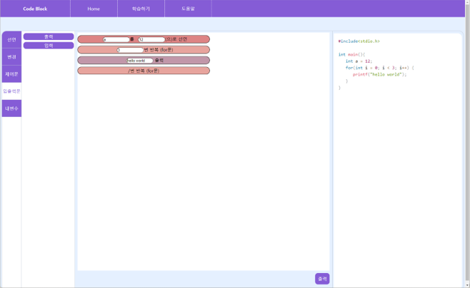
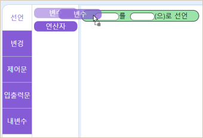
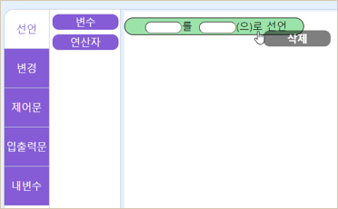
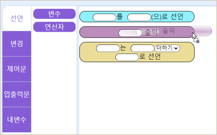
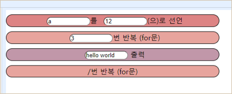
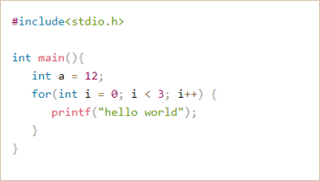
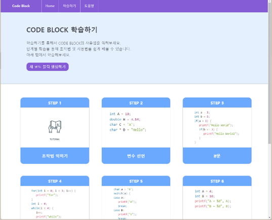
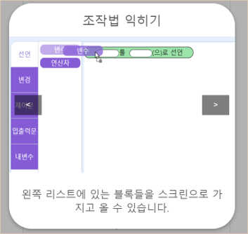
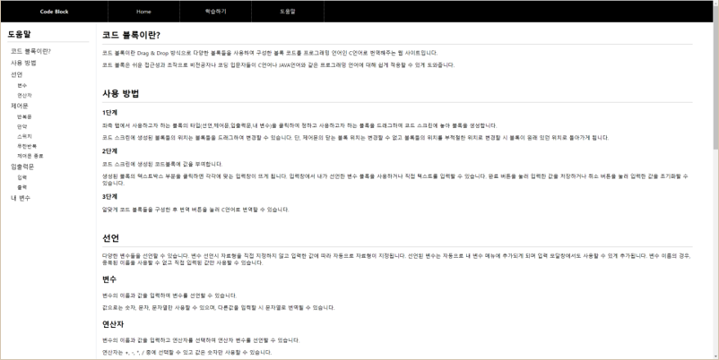

  <h1>코드 블록</h1>
   

## 소개

**교육용 블록형 프로그래밍 웹**  
코딩 교육을 돕기위한 웹 사이트로, `스크래치` 나 `엔트리` 같은 블록형 프로그래밍 언어와 같이 Drag & Drop 방식으로 코드를 블록 형태로 구성하고 그렇게 구성한 코드를 다른 프로그래밍 언어(C언어)로 변환할 수 있는 웹사이트이다.

**문제 정의**  
<li>처음 코딩을 배울 때 C언어나 JAVA와 같은 프로그래밍 언어들을 공부하게 되면 낯설고 복잡한 문장구조, 많은 양의 함수들, 부족한 컴퓨팅 사고 등으로 인해 어려움을 겪게 되는 경우가 많다. 그뿐만 아니라, 직접 텍스트를 입력하기 때문에 초보의 경우, 오류가 잦을 수 있다.</li>
 

**기대 효과**
<li>단순한 코딩 작업의 보조역할을 할 수 있다.</li>
<li>블록 코드와 프로그래밍 언어를 동시에 봐서 프로그램의 흐름을 이해하기 쉽다.</li>
<li>사용하기 쉬워 초보들도 이용할 수 있다.</li>
 

## 기술 스택 

### **Front-end**

|  |  |  |
| :-: | :-: | :-: |
| HTML5 | CSS3 | JavaScript(ES6) |

### **Back-end**

|  | 
| :-: | 
| Spring |
 

## 주요 기능

|       기능        |                 
내용
                                               |
| :---------------: | :------------------------------------------------------------------------------------------- |
| 블록 생성 | 사용자가 이용하기 원하는 블록을 화면 중앙의 블록을 배치하는 공간에 드래그를 통해 블록을 생성할 수 있다. |
| 블록 이동  | 위치를 바꾸기 원하는 블록을 클릭후 드래그를 통해 블록의 위치를 수정할 수 있다. |
| 블록 삭제 | 삭제하기 원하는 블록을 우클릭하여 삭제할 수 있다. |
| 사용자 입력 | 블록마다 존재하는 입력칸에 값을 입력하여 값을 지정하거나 수정할 수 있다.  |
| 번역 | 배치한 블록들의 배열과 값에 따라 C언어로 번역된 값을 출력해 준다. |
| 내 변수 | 사용자가 선언한 변수명과 변수값들을 확인할 수 있다. |
| 학습하기 | 조작법 익히기부터 내 변수 기능 학습까지 총 6단계로 코드블록 사용법을 학습할 수 있다. |
| 도움말 | 블록형 프로그래밍 웹에 대한 설명과 사용방법, 블록들에 대한 설명을 볼 수 있다. |
 

## 데모

<table>
    <tr>
        <th>메인 화면</th>
    </tr>
    <tr>
        <td></td>
    </tr>
</table>

<table>
    <tr>
        <th colspan="3">블록 조작</th>
    </tr>
    <tr>
        <td>생성</td>
        <td>삭제</td>
        <td>이동</td>
    </tr>
    <tr>
        <td></td>
        <td></td>
        <td></td>
    </tr>
</table>

<table>
    <tr>
        <th colspan="2">번역</th>
    </tr>
    <tr>
        <td>코드 블록</td>
        <td>번역된 후</td>
    </tr>
    <tr>
        <td></td>
        <td></td>
    </tr>
</table>

<table>
    <tr>
        <th>학습하기</th>
    </tr>
    <tr>
        <td></td>
    </tr>
</table>

<table>
    <tr>
        <th>학습하기 - 조작법 익히기</th>
    </tr>
    <tr>
        <td></td>
    </tr>
</table>

<table>
    <tr>
        <th>도움말</th>
    </tr>
    <tr>
        <td></td>
    </tr>
</table>

 

## 팀 소개

<table>
  <tr>
    <td align="center">
      
    </td>
    <td align="center">
      
    </td>
    <td align="center">
      
    </td>
  </tr>
  <tr>
    <td align="center">
      <a href="https://github.com/Ming0099">
        김민곤
      </a>
    </td>
    <td align="center">
      <a href="https://github.com/kim-1210">
        김대영
      </a>
    </td>
    <td align="center">
      <a href="https://github.com/ChristMasXs">
        김관태
      </a>
    </td>
  </tr>
</table>
 